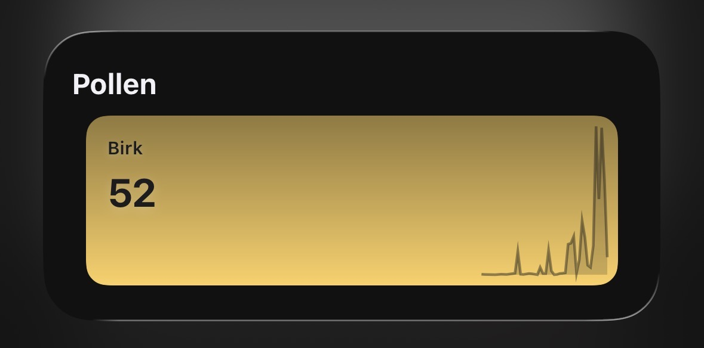

# Pollen

## `xbar`

A small `xbar` plugin for fetching and displaying allergen/pollen data from [Astma-Allergi Danmark](https://www.astma-allergi.dk/).


1. Install [xbar](https://xbarapp.com/)
2. Install [bun](https://bun.sh/)
3. Modify the first line of `pollen.5m.ts` to point to your Bun installation
   ```sh
   #!/Users/$YOUR_USER/.bun/bin/bun # Replace with your Bun path
   ```
4. Place `pollen.5m.ts` in your `xbar` plugins directory
   ```sh
   mv pollen.5m.ts ~/Library/Application\ Support/xbar/plugins/pollen.5m.ts
   ```

## Scriptable

A Scriptable script for fetching and displaying allergen/pollen data from [Astma-Allergi Danmark](https://www.astma-allergi.dk/).



1. Install [Scriptable](https://scriptable.app/)
2. Create a new Widget in Scriptable
3. Copy the contents of `pollen-scriptable` into the created widget
4. Add the Widget to the iOS home screen
